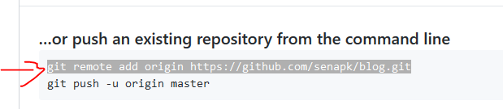

# Instalando, Configurando e Trabalhando com Repositórios Git no VSCode.

## Instalando o VSCode
- Instalar [VSCode](https://code.visualstudio.com/)
- 

## Instalando o Git
- Instalar [Git](https://git-scm.com/download)
- Baixe o git 
- Instaleos pacotes **Git Bash** e **Git Gui** 
- Selectione o VSCode como Editor Default do Git 
- **Use as opções default para todas as próximas perguntas na instalação do Git**.
- Ao final, você deve ter um aplicativo de nome **Git Bash** acessível pelo menu iniciar.
- Abra o Git Bash e digite os seguintes comandos para definir seu nome de usuário e email:

        git config --global user.email "seu_email@example.com"
        git config --global user.name "Seu Nome Aqui"

## Criando sua conta no GitHub
- Se possível, crie seu email institucional para ter acesso a várias vantagens como repositórios privados e o pacote Git Student.
- Não custa dizer, mas decore seu username e seu password.

## Abrindo o git bash no vscode
- Abra o VSCode
- Abra o Terminal
    - View -> Terminal ou apenas `Ctrl + '`
- Você pode modificar o Prompt para o Bash
    - 

## Criando seu próprio repositório
- Criando seu repositório local
    - Vá em Arquivo -> Abrir pasta, escolha a pasta onde será seu respositório local.
    - 1. Clique em Controle de Versão
    - 2. Clique em Inicializar Repositório
    - 3. Escolha sua pasta
        - 

- Salvando os arquivos localmente
    - Todos os arquivos da pasta devem aparecer agora no controle de versão. 
        - 
    - Você pode individualmente ir clicando no + que aparecerá quando pusero + sobre cada arquivo ou clicar no + do lado de CHANGES para adicionar todos os arquivos para serem salvos.
    - O status dos arquivos adicionados muda de `U`(Unstaged) para `A`(Added).
    - Arquivos modificados aparecem com letra `M`. Clique no + para adicioná-los. 
        - 
    - Após adicionar todas os arquivos nas versões que deseja salvar. Escreva a mensagem e clique no botão de commit.
    - Pronto, seus arquivos estão salvos localmente. Se for até o terminal e digitar `git log` em qualquer lugar dentro do diretório raiz, poderá ver o número do seu commit e sua mensagem. 
        - 
- Vinculando seu repositório local com seu repositório Remoto.
    - Entre na usa conta do github e crie seu repositório remoto. Não adicione o README. 
        - 
    - Opção 1: via vscode
<<<<<<< HEAD
=======
        - Entre na usa conta do github e crie seu repositório remoto. Não adicione o README. 
            - 
>>>>>>> f21d0e198c43a2da9ef755c407578b75e862e0ba
        - Copie o link do repositório. 
            - 
        - No VSCode abra a Paleta de Comandos, normalmente através do atalho `Ctrl + Shift + P`
        - Procure e execute o comando `Git: Add Remote`
        - No nome do repositório remoto coloque `origin`
        - Na url, coloque a url, no meu caso `https://github.com/senapk/blog.git`
<<<<<<< HEAD
    - Opção 2: via linha de comando
=======
    - Via linha de comando
>>>>>>> f21d0e198c43a2da9ef755c407578b75e862e0ba
        - Copie e cole essa linha no terminal do vscode 
            - 
- Enviando ao servidor Remoto.
    - Após adicionar e comitar suas alterações execute o comando "Git: Push" a partir da paleta ou do `...` na aba do controle de versão.
    - No primeiro envio, basta confirmar que você deseja criar o ramo principal `master` no servidor remoto, e a partir de então, basta dar o push para enviar as atualizações.

## Copiando de um repositório remoto que já existe.
- Para copiar algum repositório remoto para uma pasta local e deixá-los vinculados você precisa de uma operação de `clone`.
- Opção 1: linha de comando
    - Entre na pasta que quer criar seu repositório e digite `git clone https://url_do_repositorio
- Opção 2: vscode
    - Abra a paleta de comandos, adicione o link do repositório remoto e escolha a pasta local onde ele será vinculado.
- Pronto, depois disso, já pode adicionar, comitar e dar o push normalmente.
- Se estiver trabalhando com mais de uma pessoa no mesmo repositório, você pode baixar as mudanças mais recentes no repositório remoto através da operação `Git: Pull`
