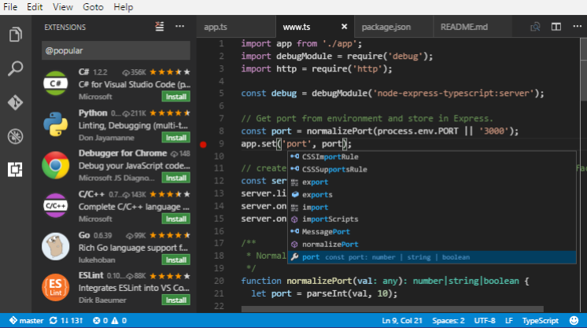
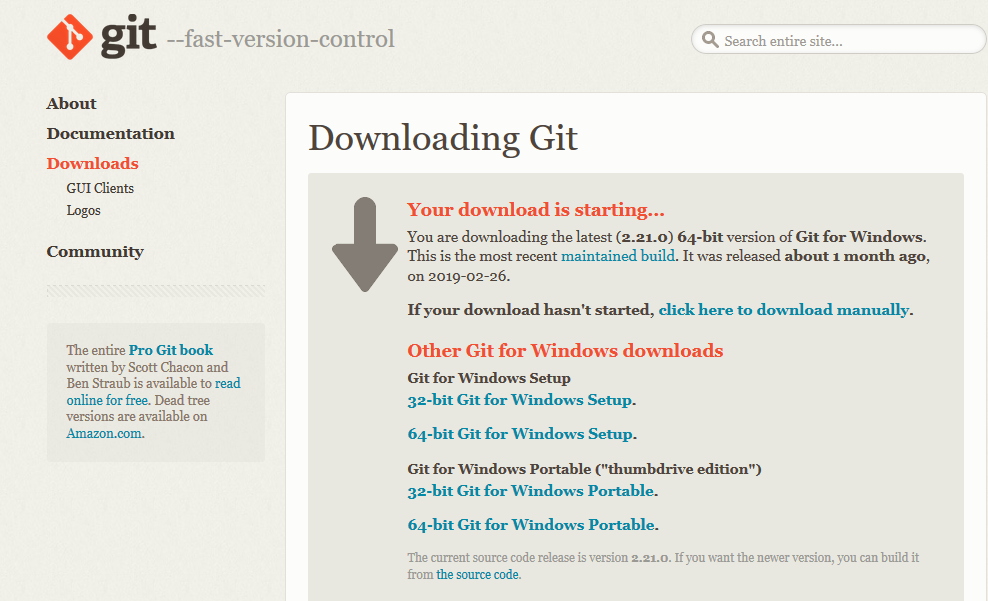
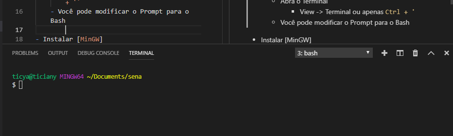
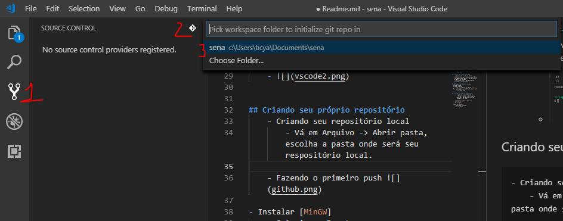
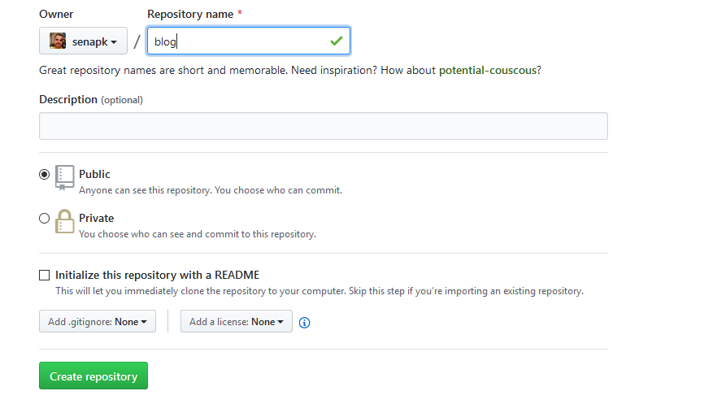
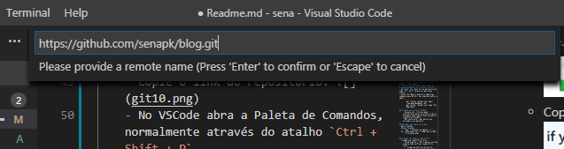

!toc

## Instalando o VSCode
- Instalar [VSCode](https://code.visualstudio.com/)
- 

## Instalando o Git
- Instalar [Git](https://git-scm.com/download)
- Baixe o git 
- Instaleos pacotes **Git Bash** e **Git Gui** 
- Selectione o VSCode como Editor Default do Git 
- **Use as opções default para todas as próximas perguntas na instalação do Git**.
- Ao final, você deve ter um aplicativo de nome **Git Bash** acessível pelo menu iniciar.
- Abra o Git Bash e digite os seguintes comandos para definir seu nome de usuário e email:

        git config --global user.email "seu_email@example.com"
        git config --global user.name "Seu Nome Aqui"

## Criando sua conta no GitHub
    - Se possível, crie seu email institucional para ter acesso a várias vantagens como repositórios privados e o pacote Git Student.
    - Não custa dizer, mas decore seu username e seu password.

## Abrindo o git bash no vscode
- Abra o VSCode
- Abra o Terminal
    - View -> Terminal ou apenas `Ctrl + '`
- Você pode modificar o Prompt para o Bash
    - 

## Criando seu próprio repositório
- Criando seu repositório local
    - Vá em Arquivo -> Abrir pasta, escolha a pasta onde será seu respositório local.
    - 1. Clique em Controle de Versão
    - 2. Clique em Inicializar Repositório
    - 3. Escolha sua pasta
    - 

- Salvando os arquivos localmente
    - Todos os arquivos da pasta devem aparecer agora no controle de versão. 
    - Você pode individualmente ir clicando no + que aparecerá quando pusero + sobre cada arquivo ou clicar no + do lado de CHANGES para adicionar todos os arquivos para serem salvos.
    - O status dos arquivos adicionados muda de `U`(Unstaged) para `A`(Added).
    - Arquivos modificados aparecem com letra `M`. Clique no + para adicioná-los. 
    - Após adicionar todas os arquivos nas versões que deseja salvar. Escreva a mensagem e clique no botão de commit.
    - Pronto, seus arquivos estão salvos localmente. Se for até o terminal e digitar `git log` em qualquer lugar dentro do diretório raiz, poderá ver o número do seu commit e sua mensagem. 
- Vinculando seu repositório local com seu repositório Remoto.
    - Entre na usa conta do github e crie seu repositório remoto. Não adicione o README. 
    - Copie o link do repositório. 
    - No VSCode abra a Paleta de Comandos, normalmente através do atalho `Ctrl + Shift + P`
    - Procure e execute o comando `Git: Add Remote`
    - Digite o link do seu repositório , digite Enter 2 vezes.
    
    - Fazendo o primeiro push 

- Instalar [MinGW]
    - Selecionar Pacotes
    - Marcar Apply
    - 